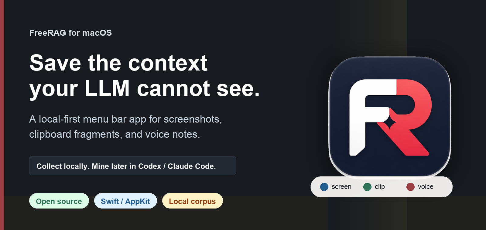

# FreeRAG

FreeRAG is a tiny native macOS menu bar app that turns screenshots, clipboard fragments, and voice notes into a local corpus for coding agents and LLM workflows.

It is built for people who use Codex / Claude Code and keep losing useful context in screenshots, browser tabs, copied text, meeting notes, and half-finished thoughts.

[简体中文说明](README.zh-CN.md)

**Open Source Beta:** FreeRAG is distributed through GitHub Releases as a Developer ID signed and Apple-notarized DMG.

<p>
  <a href="https://github.com/balue8246-maker/FreeRAG/releases/download/v0.5.1-beta.3/FreeRAG-0.5.1-build-4.dmg"><strong>Download DMG</strong></a>
  ·
  <a href="docs/QUICKSTART.md">Quickstart</a>
  ·
  <a href="docs/DEMO.md">Demo</a>
  ·
  <a href="docs/FAQ.md">FAQ</a>
  ·
  <a href="https://github.com/balue8246-maker/FreeRAG/releases/latest">Latest Release</a>
  ·
  <a href="docs/LAUNCH_KIT.md">Launch Kit</a>
</p>



## 30-Second Flow

1. Collect raw context from the menu bar HUD: screen, clipboard, or voice.
2. FreeRAG writes everything locally under `~/Documents/Corpus/`.
3. Ask MyRAG in Codex / Claude Code to mine recent material.
4. MyRAG folds duplicates, reads representative evidence, and returns a table: one matter per row.
5. You decide what should become a worklog, project note, or cleaned-up raw entry.

## Download

- [Download DMG](https://github.com/balue8246-maker/FreeRAG/releases/download/v0.5.1-beta.3/FreeRAG-0.5.1-build-4.dmg)
- [Latest GitHub Release](https://github.com/balue8246-maker/FreeRAG/releases/latest)
- Current beta: `0.5.1`, build `4`
- macOS app: Swift / AppKit, menu bar only

This beta build is Developer ID signed and Apple-notarized. macOS may still ask for normal app permissions such as Screen Recording, Accessibility, and Microphone.

## Product Boundary

FreeRAG collects. MyRAG reads and mines.

FreeRAG does not upload screenshots, clipboard content, or voice recordings by itself. The local corpus is intended for explicit use by the user through Codex / Claude Code and the bundled MyRAG runtime skill.

MyRAG is split into two layers:

- `SKILL.md`: the runtime corpus-mining protocol used during normal work.
- `INSTALL_ADAPTERS.md`: one-time model/environment setup for Vision and ASR when the current LLM cannot read images or transcribe audio.

MyRAG output is table-first: one matter per row, with facts, numbers, people/projects, judgment, risk, next step, evidence, and confidence merged into the same row. Large repeated clipboard images are folded by exact SHA-256 before reading representative samples.

## What It Does

- Captures local raw material into a consistent corpus folder.
- Keeps the macOS app small: no automatic cloud analysis, no default OCR, no default transcription.
- Lets MyRAG read the local corpus and produce a matter-by-matter summary table for the user.
- Keeps model-specific Vision / ASR setup outside the runtime skill, so the daily MyRAG workflow stays portable.
- Marks raw material as done only after the user has reviewed the summary and confirmed that the raw evidence has been taken over.

## Repository Layout

```text
FreeRAG/
  CLI/                       Offline command-line helper for agent/script writes.
  Packaging/                 Build scripts for the native app and DMG.
  Resources/Assets/           App icon and status assets.
  Sources/main.swift          Swift/AppKit app implementation.
shared/skills/myrag/          MyRAG runtime skill and local corpus helper script.
shared/skills/myrag/INSTALL_ADAPTERS.md
                              Vision / ASR setup for different model environments.
docs/                         Product docs, public status, and overview pages.
release/github/               GitHub publication plan, checklist, release notes.
```

## Build

```bash
FreeRAG/Packaging/build_native_app.sh
FreeRAG/Packaging/build_dmg.sh
```

Local build output goes to `dist/`. `dist/` is intentionally ignored by Git; public binaries should be attached to GitHub Releases instead of committed to the source repository.

Current app version: `0.5.1`, build `4`.

Developer ID release build:

```bash
FreeRAG/Packaging/build_release_dmg.sh
```

This script signs `FreeRAG.app` with `Developer ID Application`, builds and signs the DMG, submits it with `notarytool`, staples the ticket, runs Gatekeeper checks, and updates the local `.sha256` file. It expects a stored notary profile named `freerag-notary` unless `FREERAG_NOTARY_PROFILE` is set.

## CLI

FreeRAG also includes a lightweight offline CLI for agent and script workflows. It does not control the running menu bar app; it writes directly to the same local corpus schema.

```bash
FreeRAG/CLI/freerag note "Remember this local context"
FreeRAG/CLI/freerag note --stdin < notes.md
FreeRAG/CLI/freerag shot
FreeRAG/CLI/freerag image ./reference.png
FreeRAG/CLI/freerag voice ./recording.wav
FreeRAG/CLI/freerag list --limit 10
FreeRAG/CLI/freerag latest --open
```

`freerag shot` calls macOS `screencapture`, so Screen Recording permission belongs to the terminal or agent process that runs the CLI, not to `FreeRAG.app`.

Set `FREERAG_CORPUS=/path/to/Corpus` to target a non-default corpus for tests or scripted workflows.

## Install

1. Download the DMG from a GitHub Release.
2. Drag `FreeRAG.app` to `/Applications`.
3. Launch it from `/Applications` so macOS permissions stay tied to a stable app location.
4. If macOS asks for normal app permissions, approve Screen Recording, Accessibility, and Microphone as needed.
5. Grant Screen Recording, Accessibility, and Microphone permissions when needed.
6. Copy the bundled `myrag` skill into your Codex / Claude Code skill directory if you want LLM-side corpus mining.
7. If your current model cannot inspect images or transcribe recordings, follow `shared/skills/myrag/INSTALL_ADAPTERS.md` before using MyRAG on multimodal corpus entries.

## Local Corpus

```text
~/Documents/Corpus/
  _index.json
  _library.json
  README_FOR_LLM.md
  screen/
  clipboard/
  voice/
  processed/
```

`processed/` is optional and should contain only high-density summaries, worklogs, project notes, or confirmed representative evidence. MyRAG should not convert hundreds of noisy raw entries into hundreds of processed directories.

## Privacy

See [PRIVACY.md](PRIVACY.md). Short version: raw evidence stays local by default. Do not commit or publish a corpus folder, screenshots, recordings, transcripts, API keys, or private team/customer data.

## Security

See [SECURITY.md](SECURITY.md) for reporting and release-safety notes.

## Product Pages

- [Quickstart](docs/QUICKSTART.md)
- [Demo walkthrough](docs/DEMO.md)
- [FAQ](docs/FAQ.md)
- [Simplified Chinese product overview](docs/product_overview.zh-CN.html)
- [English product overview](docs/product_overview.en.html)

## License

MIT. See [LICENSE](LICENSE).
